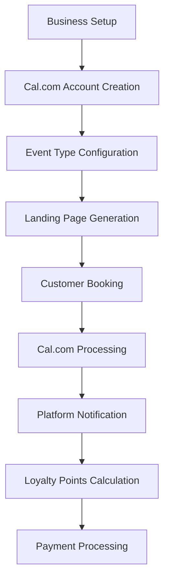

# Universal Service Business Platform - Technical Implementation Plan

## Executive Summary

This technical implementation plan outlines the architecture and development approach for the Universal Service Business Platform, leveraging Turborepo for monorepo management, Cal.com for booking systems, and Webstudio for template generation. The platform will serve as a "Shopify for service businesses" with integrated booking, payments, and loyalty systems.

## Architecture Overview

### Technology Stack
- **Monorepo Management**: Turborepo for build optimization and caching
- **Frontend**: Next.js 15+ with React 19, TypeScript, Tailwind
- **Backend**: Node.js/TypeScript with tRPC for type-safe APIs
- **Database**: PostgreSQL with Prisma ORM
- **Booking System**: Cal.com API integration
- **Payment Processing**: Stripe Connect API
- **Template System**: Webstudio integration for business landing pages
- **Hosting**: Vercel (frontend) + Railway (backend)
- **Caching**: Redis for session management and API caching

## Turborepo Monorepo Structure

```
universal-service-platform/
├── turbo.json                    # Turborepo configuration
├── package.json                  # Root package.json
├── packages/
│   ├── ui/                      # Shared UI components
│   ├── config/                  # Shared configurations (ESLint, TypeScript, Tailwind)
│   ├── database/                # Prisma schema and migrations
│   └── types/                   # Shared TypeScript types
├── apps/
│   ├── web/                     # Main SaaS platform (Next.js)
│   ├── dashboard/               # Business owner dashboard (Next.js)
│   ├── api/                     # Backend API server (Express/Fastify)
│   ├── template-builder/        # Webstudio integration service
│   └── landing-pages/           # Generated business landing pages (Next.js)
└── tools/
    ├── eslint-config/           # Custom ESLint configuration
    ├── database-seed/           # Database seeding scripts
    └── deployment/              # CI/CD and deployment scripts
```

### Turborepo Configuration (turbo.json)

```json
{
  "$schema": "https://turbo.build/schema.json",
  "pipeline": {
    "build": {
      "dependsOn": ["^build"],
      "outputs": [".next/**", "!.next/cache/**", "dist/**"]
    },
    "dev": {
      "cache": false,
      "persistent": true
    },
    "lint": {
      "dependsOn": ["^build"]
    },
    "test": {
      "dependsOn": ["^build"],
      "inputs": ["src/**/*.tsx", "src/**/*.ts", "test/**/*.ts", "test/**/*.tsx"]
    },
    "type-check": {
      "dependsOn": ["^build"]
    },
    "clean": {
      "cache": false
    }
  },
  "remoteCache": {
    "signature": true
  }
}
```

## Cal.com Integration Architecture

### Booking System Integration

#### Core Integration Components

1. **Cal.com API Client** (`packages/integrations/cal-com/`)
```typescript
interface CalComService {
  createBooking(params: CreateBookingRequest): Promise<Booking>;
  getBookings(userId: string): Promise<Booking[]>;
  updateAvailability(userId: string, availability: Availability): Promise<void>;
  setupWebhooks(businessId: string): Promise<WebhookConfig>;
}
```

2. **Business Booking Configuration**
```typescript
interface BusinessBookingConfig {
  businessId: string;
  calComUserId: string;
  eventTypes: EventType[];
  availability: WeeklyAvailability;
  services: ServiceOffering[];
}
```

3. **Webhook Integration** (`apps/api/webhooks/cal-com/`)
```typescript
// Handle Cal.com webhooks for booking events
const webhookHandlers = {
  'booking.created': handleBookingCreated,
  'booking.cancelled': handleBookingCancelled,
  'booking.rescheduled': handleBookingRescheduled
};
```

#### Implementation Strategy

1. **OAuth Integration**: Use Cal.com OAuth to connect business accounts
2. **Event Type Creation**: Automatically create service-specific event types
3. **Embedded Booking**: Integrate Cal.com booking widgets into generated landing pages
4. **Sync Management**: Real-time synchronization between platform and Cal.com data

### Booking Flow Architecture



## Webstudio Integration System

### Template Management Architecture

#### Template Generation Service (`apps/template-builder/`)

```typescript
interface WebstudioService {
  generateTemplate(business: BusinessProfile): Promise<Template>;
  customizeTemplate(templateId: string, customizations: CustomizationOptions): Promise<Template>;
  publishTemplate(templateId: string, domain: string): Promise<PublishResult>;
}

interface Template {
  id: string;
  businessId: string;
  webstudioProjectId: string;
  customizations: CustomizationOptions;
  publishedUrl: string;
  metadata: TemplateMetadata;
}
```

#### Industry-Specific Templates

1. **Wellness Templates**
   - Massage therapy
   - Yoga/fitness
   - Mental health counseling
   - Spa services

2. **Professional Services Templates**
   - Consulting
   - Legal services
   - Accounting
   - Coaching

3. **Creative Services Templates**
   - Photography
   - Design services
   - Event planning
   - Personal styling

#### Template Customization System

```typescript
interface CustomizationOptions {
  branding: {
    logo: string;
    colors: ColorPalette;
    fonts: FontConfiguration;
  };
  content: {
    businessName: string;
    description: string;
    services: ServiceDescription[];
    testimonials: Testimonial[];
  };
  layout: {
    sections: TemplateSection[];
    booking: BookingWidgetConfig;
    contact: ContactConfig;
  };
}
```

### Template-to-Landing-Page Pipeline

1. **Business Onboarding**: Collect business information and preferences
2. **Template Selection**: AI-assisted template recommendation based on industry
3. **Customization**: Apply business branding and content
4. **Cal.com Integration**: Embed booking widgets and service configurations
5. **Deployment**: Publish to custom domain with CDN optimization

## Database Schema Design

### Core Business Entities

```prisma
// Business and User Management
model Business {
  id          String   @id @default(uuid())
  name        String
  slug        String   @unique
  industry    String
  ownerId     String
  owner       User     @relation(fields: [ownerId], references: [id])

  // Template and Branding
  templateId     String?
  template       Template?     @relation(fields: [templateId], references: [id])
  customizations Json?
  domain         String?       @unique

  // Integrations
  calComUserId     String?
  stripeAccountId  String?

  // Business Configuration
  services         Service[]
  bookings         Booking[]
  loyaltyProgram   LoyaltyProgram?

  createdAt DateTime @default(now())
  updatedAt DateTime @updatedAt
}

// Service Management
model Service {
  id          String   @id @default(uuid())
  businessId  String
  business    Business @relation(fields: [businessId], references: [id])

  name        String
  description String
  duration    Int      // minutes
  price       Decimal

  calComEventTypeId String?

  bookings    Booking[]

  createdAt DateTime @default(now())
  updatedAt DateTime @updatedAt
}

// Booking Management
model Booking {
  id         String   @id @default(uuid())
  businessId String
  business   Business @relation(fields: [businessId], references: [id])
  serviceId  String
  service    Service  @relation(fields: [serviceId], references: [id])
  customerId String
  customer   Customer @relation(fields: [customerId], references: [id])

  // Cal.com Integration
  calComBookingId String? @unique

  // Booking Details
  startTime      DateTime
  endTime        DateTime
  status         BookingStatus
  price          Decimal

  // Payment Integration
  stripePaymentIntentId String?
  paymentStatus         PaymentStatus

  // Loyalty Points
  pointsEarned Int @default(0)

  createdAt DateTime @default(now())
  updatedAt DateTime @updatedAt
}

// Loyalty System
model LoyaltyProgram {
  id         String   @id @default(uuid())
  businessId String   @unique
  business   Business @relation(fields: [businessId], references: [id])

  pointsPerDollar    Decimal @default(1)
  welcomeBonusPoints Int     @default(0)
  referralPoints     Int     @default(100)

  customers LoyaltyCustomer[]

  createdAt DateTime @default(now())
  updatedAt DateTime @updatedAt
}
```

## API Architecture (tRPC)

### Router Structure

```typescript
// Root router configuration
export const appRouter = router({
  business: businessRouter,
  booking: bookingRouter,
  customer: customerRouter,
  loyalty: loyaltyRouter,
  template: templateRouter,
  integration: integrationRouter,
});

// Business management router
const businessRouter = router({
  create: protectedProcedure
    .input(createBusinessSchema)
    .mutation(async ({ input, ctx }) => {
      // Create business, initialize Cal.com integration, generate template
    }),

  update: protectedProcedure
    .input(updateBusinessSchema)
    .mutation(async ({ input, ctx }) => {
      // Update business details, sync with integrations
    }),

  setupCalCom: protectedProcedure
    .input(calComSetupSchema)
    .mutation(async ({ input, ctx }) => {
      // OAuth flow for Cal.com integration
    }),

  generateTemplate: protectedProcedure
    .input(templateGenerationSchema)
    .mutation(async ({ input, ctx }) => {
      // Generate Webstudio template based on business details
    }),
});
```

## Integration Services Architecture

### Service Layer Organization

```typescript
// Integration service interfaces
interface IntegrationService {
  authenticate(credentials: unknown): Promise<AuthResult>;
  syncData(businessId: string): Promise<SyncResult>;
  handleWebhook(payload: unknown): Promise<void>;
}

// Cal.com service implementation
class CalComIntegrationService implements IntegrationService {
  async authenticate(credentials: CalComCredentials): Promise<AuthResult> {
    // OAuth flow implementation
  }

  async createEventType(business: Business, service: Service): Promise<EventType> {
    // Create Cal.com event type for service
  }

  async syncBookings(businessId: string): Promise<SyncResult> {
    // Sync bookings between Cal.com and platform
  }
}

// Stripe Connect service implementation
class StripeConnectService implements IntegrationService {
  async setupConnectedAccount(business: Business): Promise<ConnectedAccount> {
    // Setup Stripe Connect account
  }

  async processPayment(booking: Booking): Promise<PaymentResult> {
    // Process payment with platform fees
  }
}

// Webstudio service implementation
class WebstudioService {
  async createTemplate(business: Business): Promise<Template> {
    // Generate template using Webstudio API
  }

  async deployTemplate(template: Template, domain: string): Promise<DeployResult> {
    // Deploy template to custom domain
  }
}
```

## MVP Development Phases

### Phase 1: Core Infrastructure (Weeks 1-4)
- [ ] Turborepo monorepo setup
- [ ] Database schema implementation with Prisma
- [ ] Basic authentication and user management
- [ ] tRPC API foundation
- [ ] Business onboarding flow

### Phase 2: Cal.com Integration (Weeks 5-8)
- [ ] Cal.com OAuth integration
- [ ] Event type creation and management
- [ ] Booking synchronization
- [ ] Webhook handling system
- [ ] Basic booking management UI

### Phase 3: Template System (Weeks 9-12)
- [ ] Webstudio API integration
- [ ] Template generation engine
- [ ] Industry-specific template creation
- [ ] Customization interface
- [ ] Landing page deployment system

### Phase 4: Payment & Loyalty (Weeks 13-16)
- [ ] Stripe Connect integration
- [ ] Payment processing flow
- [ ] Basic loyalty points system
- [ ] Customer management
- [ ] Analytics dashboard

## Development Workflow with Turborepo

### Development Commands

```bash
# Install dependencies
npm install

# Start all development servers
npm run dev

# Start specific app
npm run dev --filter=web

# Build all packages
npm run build

# Run tests across all packages
npm run test

# Lint all code
npm run lint

# Type check all packages
npm run type-check
```

### CI/CD Pipeline

```yaml
# .github/workflows/ci.yml
name: CI
on: [push, pull_request]
jobs:
  test:
    runs-on: ubuntu-latest
    steps:
      - uses: actions/checkout@v3
      - uses: actions/setup-node@v3
      - run: npm ci
      - run: npm run build
      - run: npm run test
      - run: npm run lint
      - run: npm run type-check
```

## Security Considerations

### Authentication & Authorization
- JWT-based authentication with refresh tokens
- Role-based access control (business owner, customer, admin)
- OAuth integration security for Cal.com and Stripe

### Data Protection
- Encryption at rest for sensitive data
- HTTPS everywhere with HSTS headers
- Input validation and sanitization
- Rate limiting on all API endpoints

### Payment Security
- PCI DSS compliance through Stripe
- Webhook signature verification
- Secure handling of payment data

### API Security
- CORS configuration
- API versioning strategy
- Request/response logging
- Error handling without data leakage

## Performance Optimization

### Turborepo Caching Strategy
- Build output caching for faster deployments
- Test result caching for faster feedback
- Remote caching for team development

### Application Performance
- Next.js Static Site Generation for landing pages
- Redis caching for API responses
- CDN for static assets
- Database query optimization with Prisma

### Monitoring & Observability
- Application performance monitoring (APM)
- Error tracking and alerting
- User analytics and conversion tracking
- Infrastructure monitoring

## Deployment Strategy

### Infrastructure
- **Frontend**: Vercel for automatic deployments and edge optimization
- **Backend**: Railway for containerized API deployment
- **Database**: Managed PostgreSQL (Railway or PlanetScale)
- **Cache**: Redis Cloud for session and API caching

### Environment Management
```bash
# Development
npm run dev

# Staging
npm run build:staging
npm run deploy:staging

# Production
npm run build:production
npm run deploy:production
```

### Database Migrations
```bash
# Generate migration
npx prisma migrate dev

# Deploy to production
npx prisma migrate deploy
```

## Next Steps for Implementation

1. **Set up Turborepo monorepo structure**
2. **Implement database schema with Prisma**
3. **Create Cal.com integration proof of concept**
4. **Develop Webstudio template generation system**
5. **Build business onboarding flow**
6. **Integrate Stripe Connect for payments**
7. **Implement basic loyalty system**
8. **Create analytics dashboard**

This technical implementation plan provides a comprehensive foundation for building the Universal Service Business Platform using modern, scalable technologies and best practices.